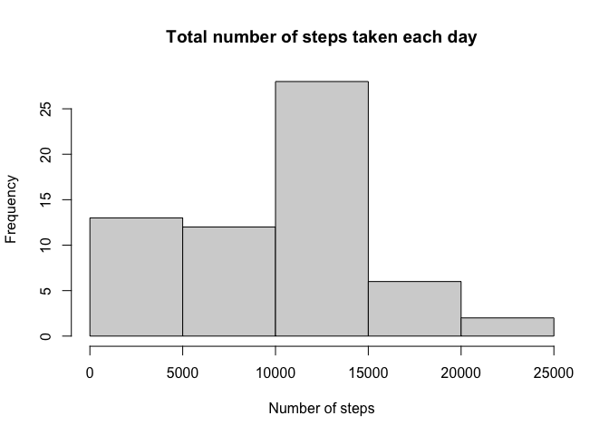
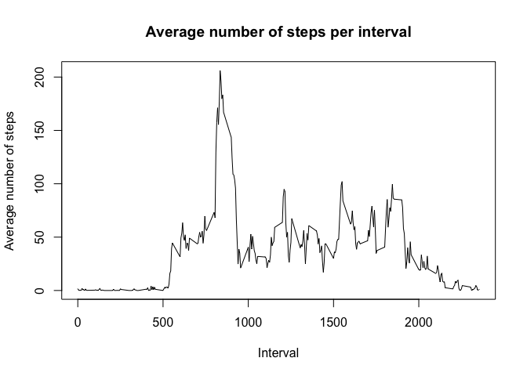
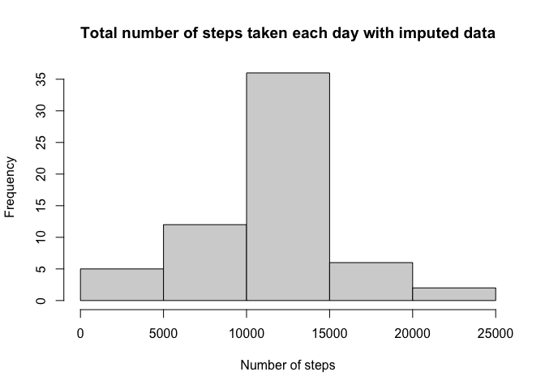
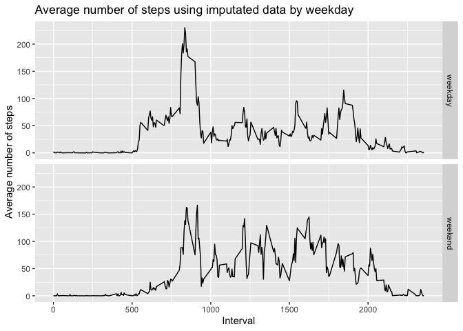

Here are codes and results for the first peer-reviwed assignment 1.

## Loading and preprocessing the data

First, to load the packages used to process and plot the data and the actucal data:


```r
library(tidyverse)
```


```r
activity <- read.csv(unz("activity.zip","activity.csv"))
```

## What is mean total number of steps taken per day?

1. Calculate the total number of steps taken per day  


```r
activity_per_day <- activity %>%
  group_by(date) %>%
  summarize(steps = sum(steps, na.rm=TRUE))

activity_per_day
```

```
## # A tibble: 61 x 2
##    date       steps
##  * <chr>      <int>
##  1 2012-10-01     0
##  2 2012-10-02   126
##  3 2012-10-03 11352
##  4 2012-10-04 12116
##  5 2012-10-05 13294
##  6 2012-10-06 15420
##  7 2012-10-07 11015
##  8 2012-10-08     0
##  9 2012-10-09 12811
## 10 2012-10-10  9900
## # … with 51 more rows
```

2. Make a histogram of the total number of steps taken each day  


```r
hist(activity_per_day$steps,
     main = "Total number of steps taken each day",
     xlab = "Number of steps")
```

<!-- -->

3. Calculate and report the mean and median of the total number of steps taken per day


```r
mean_steps <- mean(activity_per_day$steps)
median_steps <- median(activity_per_day$steps)
```

The mean of the total number of steps taken per day is 9354, and the median is 10395.

## What is the average daily activity pattern?
1. Make a time series plot (i.e. type = "l") of the 5-minute interval (x-axis) and the average number of steps taken, averaged across all days (y-axis)  


```r
activity_per_interval <- activity %>%
  group_by(interval) %>%
  summarize(steps = mean(steps, na.rm=TRUE))

plot(activity_per_interval$interval,activity_per_interval$steps,
     type = "l", 
     main = "Average number of steps per interval",
     xlab = "Interval",
     ylab = "Average number of steps")
```

<!-- -->

2. The 5-minute interval whose value equal to **835**, on average across all the days in the dataset, contains the maximum number of steps.

## Imputing missing values

1. Calculate and report the total number of missing values in the dataset (i.e. the total number of rows with NAs)


```r
missing_value <- sum(is.na(activity$steps))
```

There are a total of 2304 rows with NAs.  

2. The strategy for filling in all of the missing values in the dataset is **the mean (rounded to the nearest integer) for that 5-minute interval**.  

3. Create a new dataset that is equal to the original dataset but with the missing data filled in


```r
activity_imputeNA <- activity %>%
  group_by(across(interval)) %>%
  mutate(interval_mean = as.integer(round(mean(steps, na.rm=TRUE)))) %>%
  mutate(steps = case_when(
    is.na(steps) ~ interval_mean,
    TRUE ~ steps
  )) %>%
  select(-interval_mean)
```

4. Make a histogram of the total number of steps taken each day and Calculate and report the mean and median total number of steps taken per day. 


```r
activity_imputedNA_per_day <- activity_imputeNA %>%
  group_by(date) %>%
  summarize(steps = sum(steps, na.rm=TRUE))

hist(activity_imputedNA_per_day$steps,
     main = "Total number of steps taken each day with imputed data",
     xlab = "Number of steps")
```

<!-- -->

```r
mean_steps_imputedNA <- mean(activity_imputedNA_per_day$steps)
median_steps_imputedNA <- median(activity_imputedNA_per_day$steps)

differ <- function(x,y){
  if(x == y){
    return("the same as")
  } else if (x < y){
    return("smaller than")
  } else {
    return("bigger than")
  }
}
```

The mean of the total number of steps taken per day with imputed data is 10766, and the median is 10762. The average number of steps using imputed data is **bigger than** the mean using original data. The median of steps using is **bigger than** the median using original data.

## Are there differences in activity patterns between weekdays and weekends?

1. Create a new factor variable in the dataset with two levels – “weekday” and “weekend” indicating whether a given date is a weekday or weekend day.


```r
activity_imputedNA_weekday <- activity_imputeNA %>%
  mutate(weekday = as.factor(
    case_when(
      weekdays(as.Date(date)) %in% c("Saturday", "Sunday") ~ "weekend",
      TRUE ~ "weekday"
    )
  ))
```

2. Make a panel plot containing a time series plot (i.e. type = "l") of the 5-minute interval (x-axis) and the average number of steps taken, averaged across all weekday days or weekend days (y-axis).


```r
activity_imputedNA_weekday %>%
  group_by(weekday,interval) %>%
  summarize(steps = mean(steps, na.rm=TRUE)) %>%
  ggplot(aes(interval,steps)) +
  geom_line() + 
  facet_grid(facets = weekday~.) + 
  labs(title = "Average number of steps using imputated data by weekday",
       x = "Interval",
       y = "Average number of steps")
```

<!-- -->
